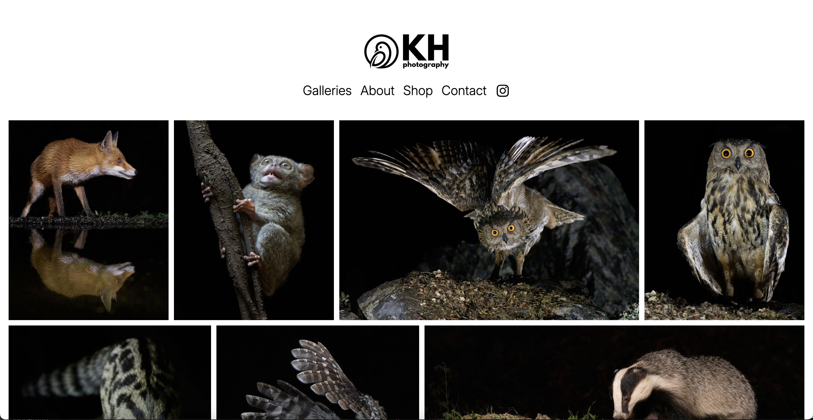
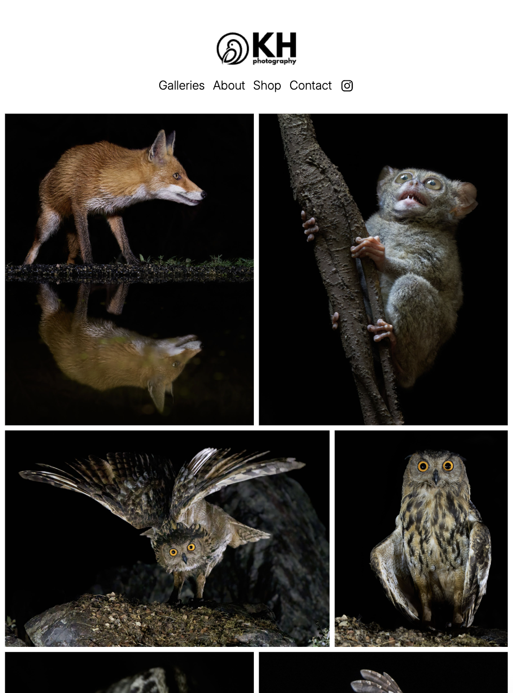
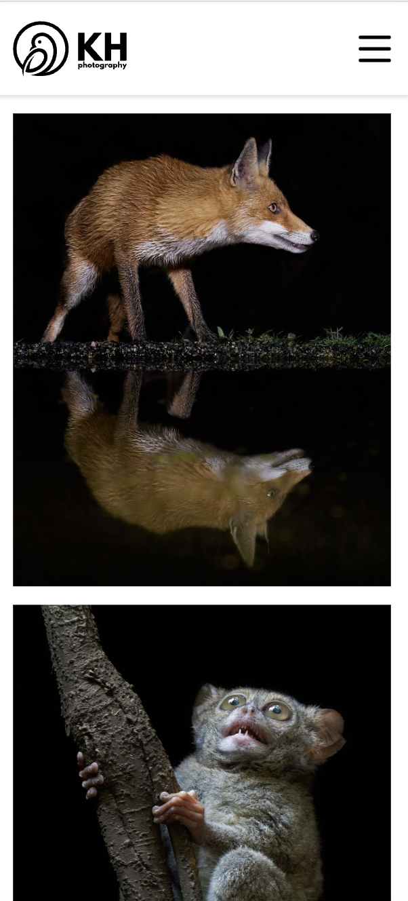

# KH Photography – eCommerce Web App

## **Role:** UI/UX Designer & Fullstack Developer  

## Overview

This project is a fully responsive, full-stack photography eCommerce web application designed to showcase curated galleries and sell physical products through secure online payments.

The application follows a modern JAMstack-inspired architecture using:

- **React (v19)** for UI rendering  
- **Vite** for fast development and optimized production builds  
- **Sanity** for structured content and photo storage  
- **Stripe** for secure checkout and webhook-based payment confirmation  
- **Printful** for automated print-on-demand fulfillment  
- **Vercel** for deployment with CI/CD and preview environments  

The system separates content management, payment processing, and fulfillment into independent services, creating a scalable and production-ready architecture.

Use the web application <a href="https://khphotography.es" target="_blank" rel="noopener noreferrer">here</a>

## Tools Used

### Development Environment
* Vite: Lightning-fast frontend tooling with HMR and optimized production builds
* Node.js: Modern JavaScript runtime environment

### Front End
* React (v19): Component-based UI architecture with hooks
* React Router (v7): Client-side routing with dynamic route handling
* React Photo Album + Yet Another React Lightbox: Optimized image gallery with modern lightbox experience
* React Hot Toast: Non-blocking UI notifications
* React Google reCAPTCHA: Bot protection & form security
* Canvas Confetti: Micro-interactions for improved UX

### Back End
* Axios: Promise-based HTTP client for API communication

### CMS / Content Management
* Sanity: Headless CMS with structured content modeling

### Payments & Fulfillment
* Stripe: Payment intents, webhooks, and secure checkout
* Printful: Automated print-on-demand fulfillment integration

### Hosting 
* Vercel: Serverless deployment, edge functions, and CI/CD

## Features

### All Users Can:

* Browse galleries
* View curated photography collections
* Open images in an immersive Lightbox viewer
* Browse products
* View products associated with the photography
* See pricing and product details
* Purchase products securely

### Fully Automated Flow of Order and Fulfillment
1. User selects product
2. Server creates Stripe Checkout session
3. User completes payment
4. Stripe emits checkout.session.completed event
5. Webhook verifies signature
6. Order is programmatically created in Printful
7. Printful handles printing and global shipping

No manual order processing is required.

## Screenshots:

   
  <em>Desktop view</em> 

   
   
  <em>Tablet view</em> 

   
   
  <em>Mobile view</em> 

## Demo Video:

  
   
  <em>Demo of khphotography.es</em>
</p
